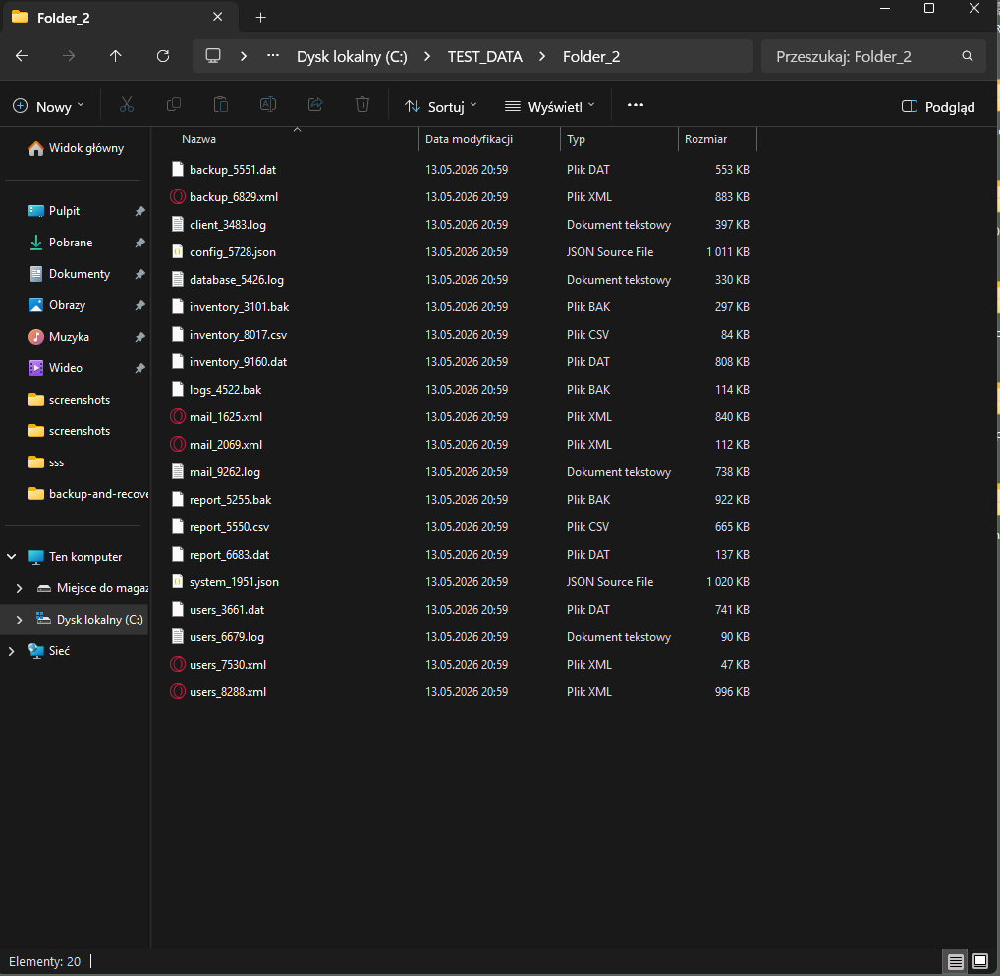
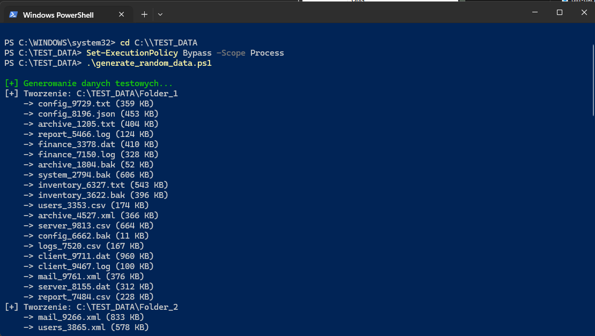
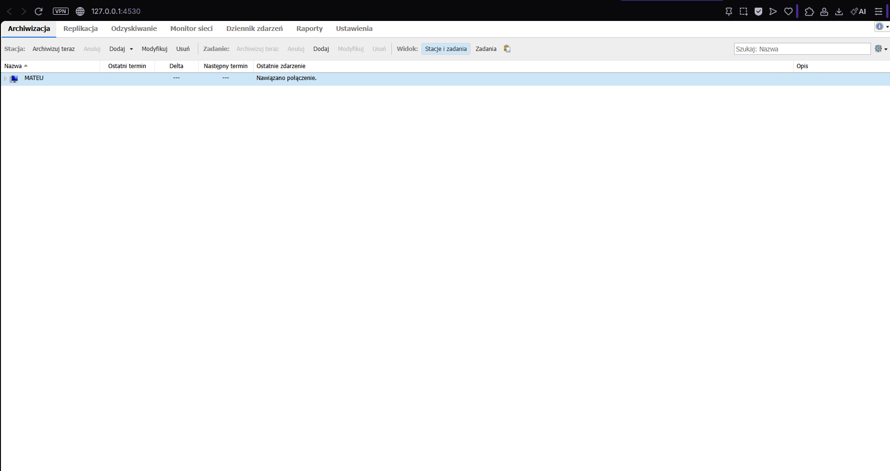
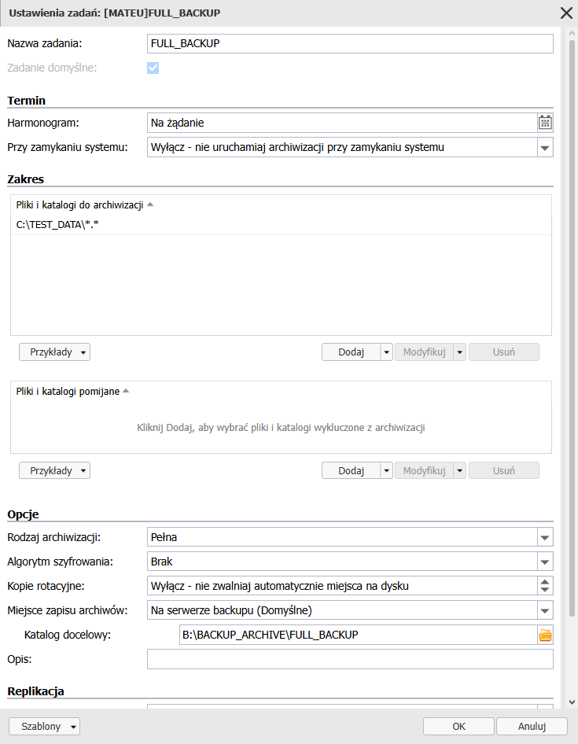
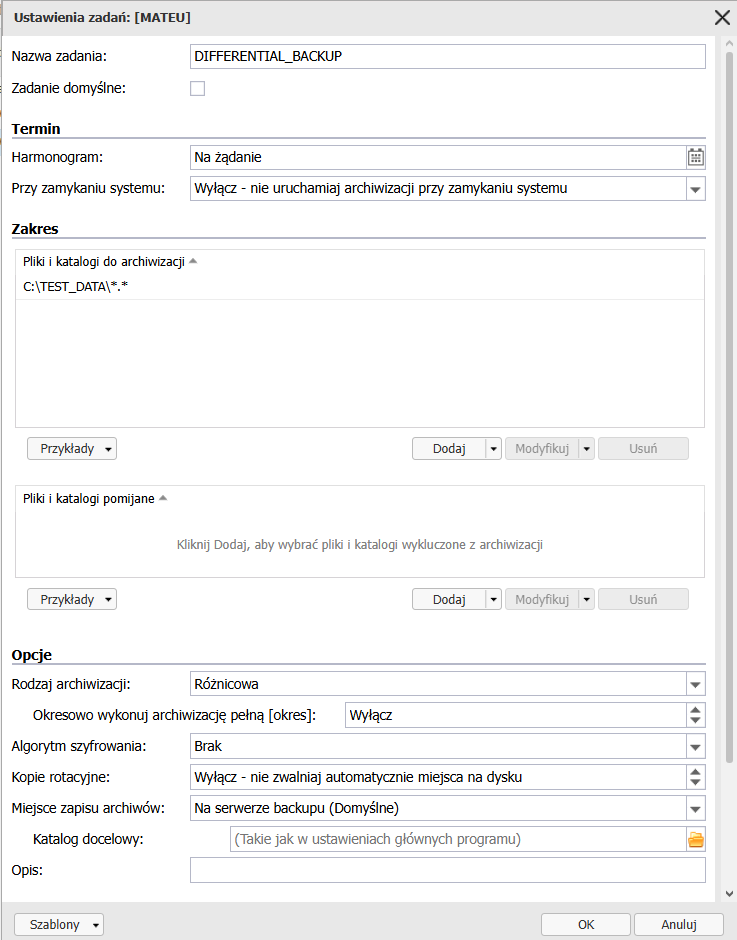
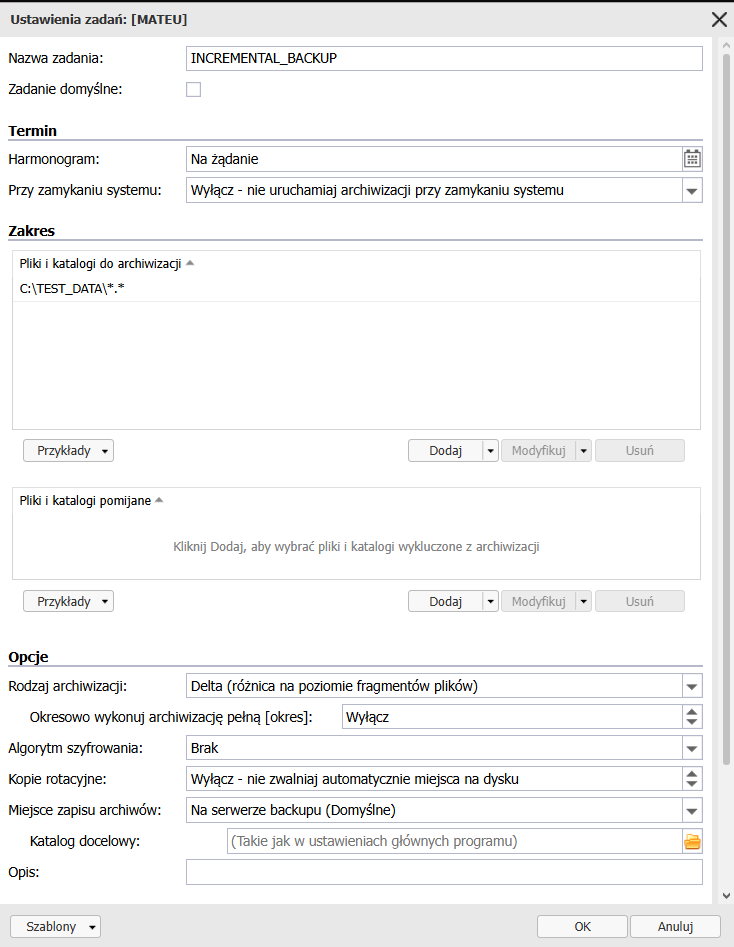
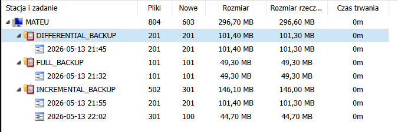
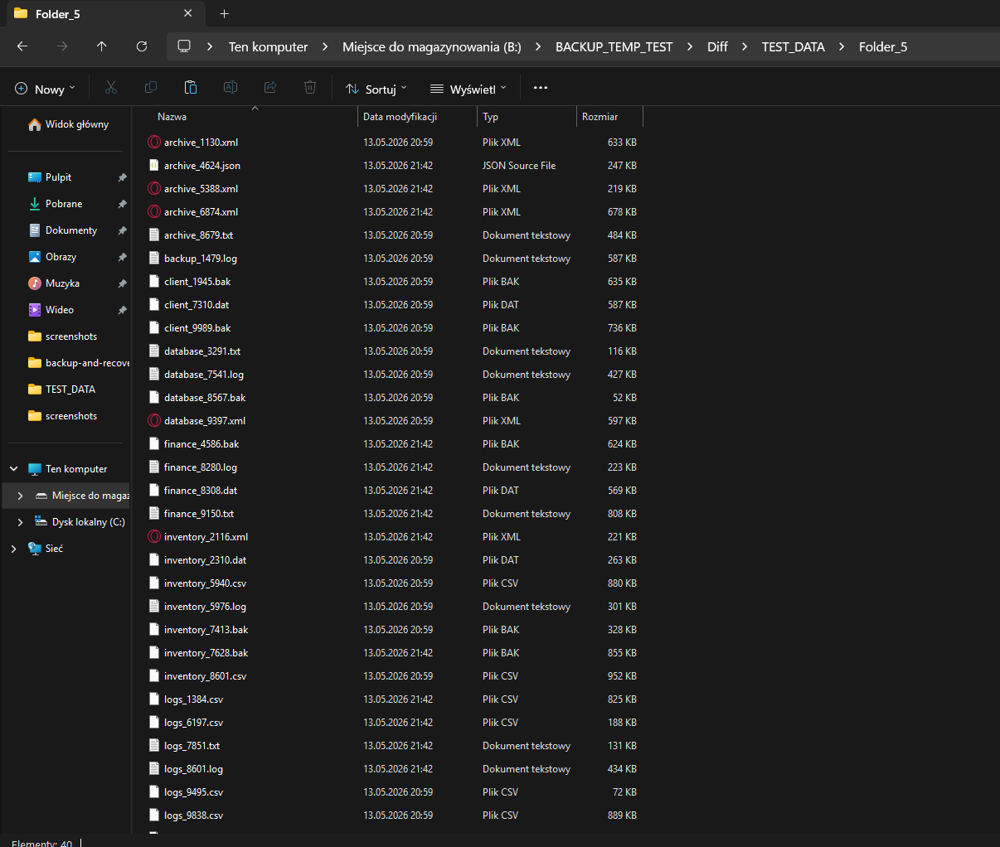
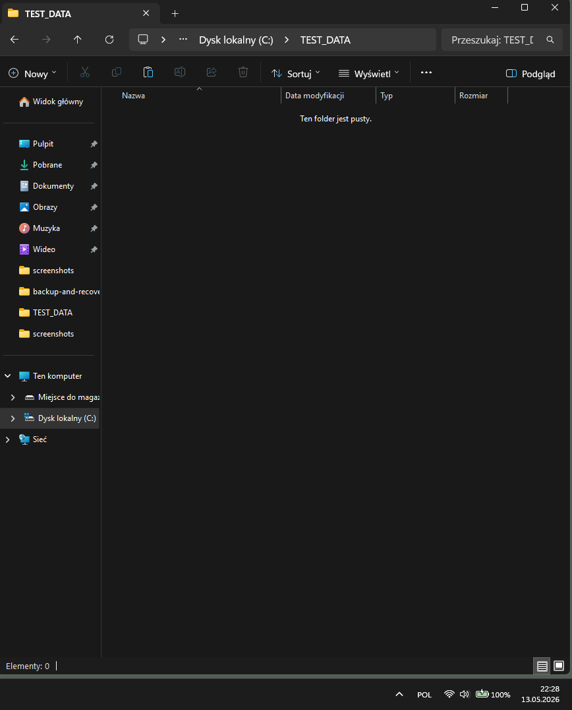
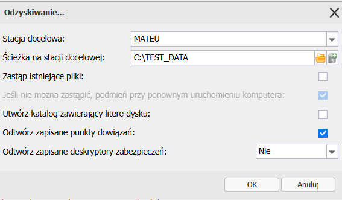

# Backup And Recovery Lab

## 🎯 Cel projektu

Celem laboratorium było stworzenie i przetestowanie środowiska backupowego, aby lepiej zrozumieć:

* jak działają kopie zapasowe,
* czym różnią się typy backupów,
* jak wygląda odzyskiwanie danych po awarii.

---

## 🖥️ Środowisko testowe

Windows 11 Pro oraz Ferro Backup System.

W projekcie użyto dwóch wolumenów:

* `C:\TEST_DATA` → dane testowe
* `B:\BACKUP_ARCHIVE` → miejsce przechowywania backupów

### Dlaczego dane i backup są na osobnych dyskach?

To dobra praktyka, ponieważ:

* awaria systemu nie usuwa backupu,
* łatwiej zabezpieczyć dane przed ransomware,
* zmniejsza się ryzyko utraty wszystkiego jednocześnie.

---

## 📂 Generowanie danych testowych

Folder roboczy:

```powershell
C:\TEST_DATA
```

Został wypełniony losowymi plikami wygenerowanymi przy użyciu PowerShell.



Pozwoliło to zasymulować realne środowisko pracy oraz sprawdzić działanie backupu na większej liczbie plików.

## ⚠️ Problemy napotkane podczas pracy

### PowerShell Execution Policy

Podczas uruchamiania skryptu PowerShell system blokował wykonanie pliku `.ps1`.

Przyczyną była domyślna polityka bezpieczeństwa PowerShell (`Execution Policy`), która ogranicza uruchamianie lokalnych skryptów.

Do testów zastosowano tymczasowy bypass:


`Set-ExecutionPolicy Bypass -Scope Process`



Ta opcja pozwala uruchomić skrypt tylko w bieżącej sesji i nie zmienia globalnych ustawień systemu.

---

## 💾 Storage backupowy

```powershell
B:\BACKUP_ARCHIVE
```

Folder był używany do przechowywania backupów oraz punktów przywracania.

---

## ⚙️ Instalacja FBS

Zainstalowano:

* FBS Server
* FBS Client

### Konfiguracja połączenia



---

## 🧩 Full Backup

### Jak działa?

Tworzy pełną kopię wszystkich danych.

### Konfiguracja



### Zalety

* prosty restore,
* pełne odtworzenie danych z jednego backupu.

### Wady

* duże zużycie miejsca,
* najdłuższy czas wykonania,
* większe obciążenie dysku.

### Wynik wykonania


---

## 📊 Differential Backup

### Jak działa?

Zapisuje wszystkie zmiany od ostatniego Full Backup.

### Konfiguracja



### Charakterystyka

Każdy kolejny differential backup staje się większy, ponieważ zawiera wszystkie zmiany od ostatniego fulla.

### Restore wymaga:

* ostatniego Full Backup,
* ostatniego Differential Backup.

---

## 🔁 Incremental Backup

### Jak działa?

Zapisuje tylko zmiany od ostatniego backupu.

### Konfiguracja



### Zalety

* małe zużycie miejsca,
* szybkie wykonywanie backupów,
* dobre rozwiązanie dla częstych backupów.

### Wady

Restore jest bardziej złożony, ponieważ zależy od całego chaina backupów.

---

## 📦 Porównanie wykonanych backupów

Poniżej widoczne jest zestawienie wszystkich wykonanych kopii oraz różnic w ich rozmiarach.



Dobrze pokazuje to różnice między Full, Differential oraz Incremental Backup pod względem zajmowanego miejsca.

---

## 🔍 Weryfikacja backupów

Sprawdzono:

* logi FBS,
* status backup jobs,
* integralność plików.

Backup może wyglądać poprawnie, ale dopiero analiza logów i test restore potwierdzają, że działa prawidłowo.

---

## ♻️ Test Restore

Dane zostały odtworzone do:

```powershell
B:\BACKUP_TEMP_TEST
```

### Wynik restore



Podczas testu sprawdzono poprawność backupów, spójność danych oraz działanie procesu restore.

---

## 💥 Symulacja awarii

Usunięto dane z folderu:

```powershell
C:\TEST_DATA
```

### Folder po usunięciu danych



Następnie wykonano restore z backupu.

### Proces przywracania danych



### Co sprawdzano?

* odzyskiwanie danych po awarii
* brak błędów FBS
* skuteczność odzyskania danych
* wyrywkowa kontrola integralności plików

### Wynik

Dane zostały poprawnie odzyskane i nie wykryto błędów integralności.

---

## 🧠 Backup vs Replikacja vs Archiwizacja

### Backup

Przechowuje historię zmian i pozwala odzyskać dane po awarii.

### Replikacja

Kopiuje dane na bieżąco i jest używana głównie do tworzenia redundancji.

### Archiwizacja

Służy do długoterminowego przechowywania danych, często w celach historycznych lub zachowania zgodności danych.

---

## Główny wniosek

Backup ma wartość dopiero wtedy, gdy można poprawnie wykonać poprawne odzyskiwanie danych. Z tego powodu kluczowym elementem tworzenia i utrzymywania kopii zapasowej jest jej testowanie.

---

## 📌 Podsumowanie - czego się nauczyłem?

W laboratorium zrealizowano:

* Full Backup,
* Differential Backup,
* Incremental Backup,
* symulację awarii,
* weryfikację integralności danych.
* konfigurację środowiska backupowego,
* analizę logów,
* praktyczne scenariusze odzyskiwania danych.
